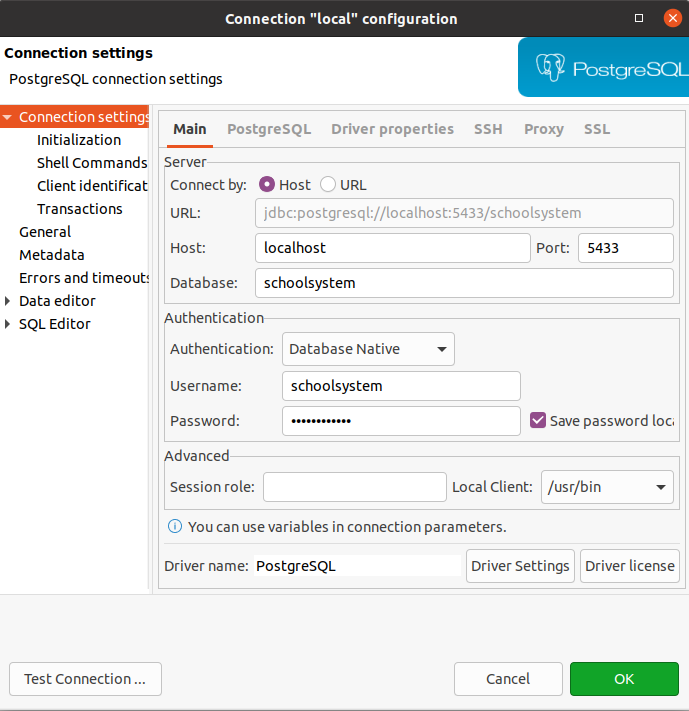

# School API

### Requirements for develop:
- `Gradle` **&ge;7.6**
- `java` **&ge;17**
- Running docker daemon

### Git flow

We use git flow with feature/bug branches merged to develop branch: `BACKEND_DEV` Therefore, pull requests are supposed to be submitted with one of development branches as a target branch.

### Branches naming convention

We use branch naming convention with group tokens as prefix. Please apply to these while contributing. The prefixes used are as following:

|   Prefix    |        Content         |             Example              |
| :---------: | :--------------------: |:--------------------------------:|
|   `feat/`   |      New feature       |         `feat/user-crud`         |
|   `bug/`    | Fixing an existing bug | `bug/mapping-name-user-property` |
| `refactor/` |    Refactoring code    |  `refactor/user-specifications`  |
|   `docs/`   |  Update documentation  |         `docs/user-crud`         |


### Pull requests naming convention

Every opened pull request should have a title which consists of prefix followed by a colon, space and short description indicating what changes the pull requests introduces, where prefixes available are:

|   Prefix   |        Content         |                        Example                        |
| :--------: | :--------------------: |:-----------------------------------------------------:|
| `Feature:` |      New feature       |           `Feature: Add user crud methods`            |
| `Bugfix:`  | Fixing an existing bug |     `Bugfix: Mapping user name property to view`      |
| `Refactor:`|    Refactoring code    | `Refactor: Replaced user queries with specifications` |
|  `Docs:`   |  Update documentation  |              `Docs: User CRUD enpoints`               |

### Flyway schema migration file name convention
`V[yyyyMMddHHmm]__name.sql`

### Code format
We follow rules for `google-java-format`\
To format code run command
```
gradle googleJavaFormat
```

### DTO's
Request DTO should have name ending with command
Response DTO should have name ending with view

### Database configuration
It's recommended to use external database tool such as DBeaver. Below image provides database connection credentials:
<p align="center">
  
</p>

### Debuger 
In Intellij choose remote JVM debug with host `localhost` and port `8000`
